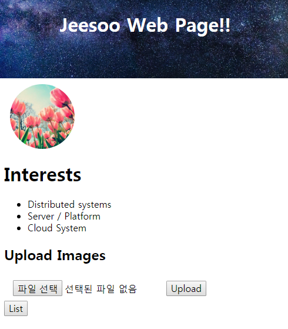

## Express.js 기반 웹 어플리케이션에서 이미지 업로드하기
이 프로젝트는 <https://github.com/kuongee/The-First-Web-Page> 공개되어있습니다.

### 1. Motivation
이 프로젝트를 시작하게 된 계기.

웹 기반 어플리케이션에 대한 이해를 돕기 위해 웹 개발 스터디에 참여했다.

Node.js(javascript)로 진행. 

스터디의 과제 중 일부인 이미지 업로드 부분에 대해 정리.

(kenu님의 도움을 받아 스터디 및 개발이 진행 되었습니다.)

### 2. 이미지 업로드 

#### 1. multer 사용
* multer 사용법 <https://github.com/expressjs/multer>

    
    
### 5. Reference
* 참고 자료
    - kenu님 <https://github.com/kenu/okweb>
    - kenu님 youtube 강좌(파일 업로드 그리고 DB)

